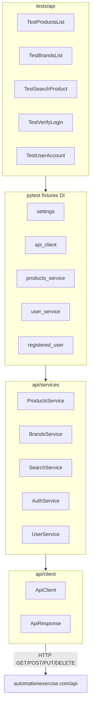

# План разработки API-автотестов (Client + Service Object)

## Контекст

Текущий репозиторий — **только UI** ([`conftest.py`](conftest.py), [`tests/test_products_page.py`](tests/test_products_page.py), Selenium POM). API-слоя нет.

Целевой сайт: [https://automationexercise.com/products](https://automationexercise.com/products)  
Документация API: [https://automationexercise.com/api_list](https://automationexercise.com/api_list)

**Scope (по вашему выбору):** API 1–6 (products/brands/search) + API 7–14 (auth + user lifecycle).

---

## Целевая архитектура



### Слои ответственности

| Слой | Роль | Пример |
|------|------|--------|
| **ApiClient** | HTTP-транспорт: session, base URL, timeout, headers, логирование, единый `request()` | `client.get("/productsList")` |
| **Service / API Object** | Один класс на группу эндпоинтов: пути, параметры, парсинг JSON | `ProductsService.get_all_products()` |
| **Models** (опционально) | Типизация ответов, переиспользование в assert | `Product`, `Brand` |
| **Tests** | Только AAA + бизнес-ожидания, без raw HTTP | `assert response.status_code == 200` |

Принцип: **тесты не знают URL и form-data** — только вызывают Service и проверяют результат.

---

## Структура каталогов (новая)

```text
autotests_automationexercise/
├── api/
│   ├── __init__.py
│   ├── client/
│   │   ├── __init__.py
│   │   ├── api_client.py      # ApiClient + ApiResponse
│   │   └── exceptions.py      # ApiClientError (опционально)
│   ├── services/
│   │   ├── __init__.py
│   │   ├── products_service.py   # API 1-2
│   │   ├── brands_service.py     # API 3-4
│   │   ├── search_service.py     # API 5-6
│   │   ├── auth_service.py       # API 7-10
│   │   └── user_service.py       # API 11-14
│   ├── models/
│   │   ├── product.py
│   │   ├── brand.py
│   │   └── user.py
│   └── config/
│       └── settings.py        # BASE_URL, timeouts, test credentials
├── tests/
│   ├── api/
│   │   ├── conftest.py        # API-only fixtures
│   │   ├── test_products_list.py
│   │   ├── test_brands_list.py
│   │   ├── test_search_product.py
│   │   ├── test_verify_login.py
│   │   └── test_user_account.py
│   └── test_products_page.py  # существующие UI-тесты
├── conftest.py                # общие хуки + UI fixtures (без изменений driver)
├── pytest.ini                 # markers: api, ui
├── requirements.txt           # + requests, python-dotenv, faker
└── README.md                  # секция API
```

UI и API **разделены**: API-тесты не зависят от `driver`.

---

## Чек-лист действий (best practices)

### Фаза 0 — Подготовка проекта

- [ ] Добавить зависимости в [`requirements.txt`](requirements.txt): `requests`, `python-dotenv`, `faker` (для уникальных email при регистрации)
- [ ] Создать [`pytest.ini`](pytest.ini) с маркерами `api` и `ui`, `testpaths = tests`
- [ ] Добавить `.env.example` с `API_BASE_URL`, `TEST_USER_EMAIL`, `TEST_USER_PASSWORD` (не коммитить `.env`)
- [ ] Реализовать [`api/config/settings.py`](api/config/settings.py): чтение env, дефолт `https://automationexercise.com/api`

### Фаза 1 — ApiClient (транспорт)

- [ ] Класс `ApiClient` с `requests.Session`, `base_url`, `default_timeout`
- [ ] Методы-обёртки: `get(path, **kwargs)`, `post(path, data=...)`, `put(...)`, `delete(...)`
- [ ] Возвращать обёртку `ApiResponse` (status_code, json, text, headers) — удобно для Assert
- [ ] Логировать method + URL + status (через `logging`, уровень DEBUG в CI)
- [ ] Не дублировать assert в клиенте — клиент **только отправляет**, не валидирует бизнес-логику

### Фаза 2 — Service / API Object (эндпоинты)

Реализовать по [api_list](https://automationexercise.com/api_list):

| Service | Методы | API # |
|---------|--------|-------|
| `ProductsService` | `get_products()`, `post_products()` | 1–2 |
| `BrandsService` | `get_brands()`, `put_brands()` | 3–4 |
| `SearchService` | `search(query)`, `search_without_param()` | 5–6 |
| `AuthService` | `verify_login(email, password)`, `verify_login_missing_email(password)`, `delete_verify_login()` | 7–10 |
| `UserService` | `create_account(payload)`, `delete_account(email, password)`, `update_account(payload)`, `get_user_by_email(email)` | 11–14 |

Каждый метод Service = **один эндпоинт + один HTTP verb**; пути — константы внутри класса (`PRODUCTS_LIST = "/productsList"`).

### Фаза 3 — Модели и тестовые данные

- [ ] `UserFactory` / builder для payload регистрации (Faker: email, name, address…)
- [ ] Фикстура `valid_user_payload` — полный набор полей из API 11
- [ ] Константы для негативных сценариев: `INVALID_EMAIL`, `INVALID_PASSWORD`
- [ ] Согласовать бренды с UI: `EXPECTED_BRANDS` из [`tests/test_products_page.py`](tests/test_products_page.py) — проверить через API `brandsList`

### Фаза 4 — Pytest fixtures (DI + setup/teardown)

В [`tests/api/conftest.py`](tests/api/conftest.py):

| Fixture | Scope | Arrange | Teardown |
|---------|-------|---------|----------|
| `settings` | session | загрузка config | — |
| `api_client` | session | `ApiClient(settings.base_url)` | `session.close()` |
| `products_service` | function | inject `api_client` | — |
| `brands_service` | function | inject `api_client` | — |
| `search_service` | function | inject `api_client` | — |
| `auth_service` | function | inject `api_client` | — |
| `user_service` | function | inject `api_client` | — |
| `registered_user` | function | **Arrange:** `create_account` → yield `{email, password, ...}` | **Teardown:** `delete_account` (API 12) даже при падении теста |
| `existing_user` | session | env credentials для API 7 | — |

**Dependency Injection:** сервисы создаются только в fixtures и передаются в тесты параметрами — тесты не инстанцируют `ApiClient` напрямую.

Пример цепочки DI:

```python
@pytest.fixture
def products_service(api_client) -> ProductsService:
    return ProductsService(api_client)
```

### Фаза 5 — Тесты с паттерном AAA

Организация: **один test class = один API-сценарий** (как в UI: `TestPageLoad`, `TestSearch`).

Шаблон теста:

```python
def test_get_all_products_returns_200(self, products_service):
    # Arrange — (опционально) подготовка данных; часто пусто для GET list
    # Act
    response = products_service.get_products()
    # Assert
    assert response.status_code == 200
    assert response.json["responseCode"] == 200
    products = response.json["products"]
    assert len(products) > 0
    assert "id" in products[0] and "name" in products[0]
```

**Маппинг тестов → API:**

- `test_products_list.py`: API 1 (200, список не пуст), API 2 (405 + message)
- `test_brands_list.py`: API 3 (200, brands), API 4 (405); cross-check с `EXPECTED_BRANDS`
- `test_search_product.py`: API 5 (parametrize: `top`, `tshirt`, `jean`), API 6 (400 + message)
- `test_verify_login.py`: API 7 (valid), 8 (400), 9 (405), 10 (404)
- `test_user_account.py`: API 11 (201), 13 (200 update), 14 (200 get by email), 12 (200 delete); использовать `registered_user` fixture

**Правила AAA:**

- **Arrange** — fixtures (`registered_user`, payloads), не бизнес-логика в Act
- **Act** — ровно один вызов Service
- **Assert** — status, `responseCode`, `message`, структура JSON; не смешивать второй Act в Assert

### Фаза 6 — Негативные и контрактные проверки

- [ ] Проверять `responseCode` в теле (сайт возвращает его в JSON)
- [ ] Проверять точные `message` для 400/404/405 (из документации)
- [ ] `@pytest.mark.parametrize` для search queries и invalid login combos
- [ ] Опционально: `jsonschema` для схемы `products` / `brands` (усиление контракта)

### Фаза 7 — Запуск, отчёты, CI

- [ ] Команды: `pytest -m api`, `pytest -m ui`, `pytest tests/api -v`
- [ ] Обновить [`README.md`](README.md): структура API, env, примеры запуска
- [ ] GitHub Actions (опционально): job `api-tests` без Chrome, `ui-tests` отдельно
- [ ] Учесть зависимость от live-сайта (как в UI README)

---

## Ключевые фрагменты реализации

### ApiClient (ядро)

```python
class ApiClient:
    def __init__(self, base_url: str, timeout: int = 30):
        self._session = requests.Session()
        self.base_url = base_url.rstrip("/")
        self.timeout = timeout

    def request(self, method: str, path: str, **kwargs) -> ApiResponse:
        url = f"{self.base_url}{path}"
        resp = self._session.request(method, url, timeout=self.timeout, **kwargs)
        return ApiResponse(resp)
```

### ProductsService (пример API Object)

```python
class ProductsService:
    PRODUCTS_LIST = "/productsList"

    def __init__(self, client: ApiClient):
        self._client = client

    def get_products(self) -> ApiResponse:
        return self._client.get(self.PRODUCTS_LIST)

    def post_products(self) -> ApiResponse:
        return self._client.post(self.PRODUCTS_LIST)
```

### Fixture lifecycle (E2E user)

```python
@pytest.fixture
def registered_user(user_service, valid_user_payload):
    create_resp = user_service.create_account(valid_user_payload)
    assert create_resp.status_code == 201
    yield valid_user_payload
    user_service.delete_account(
        email=valid_user_payload["email"],
        password=valid_user_payload["password"],
    )
```

---

## Соответствие UI и API (опциональная фаза 8)

После стабилизации API-тестов можно добавить **smoke cross-layer**:

- GET `productsList` → сравнить количество/имена с UI [`ProductsPage.get_all_product_names()`](ui/pages/products_page.py)
- Маркер `@pytest.mark.e2e` — медленные, требуют `driver` + `api_client`

Не включать в первый PR — держать API и UI независимыми.

---

## Порядок реализации (рекомендуемый)

1. Config + ApiClient + pytest.ini + markers  
2. ProductsService + BrandsService + SearchService + тесты API 1–6  
3. AuthService + тесты API 7–10 (с env user)  
4. UserService + `registered_user` fixture + тесты API 11–14  
5. README + примеры запуска  
6. (Опционально) CI и jsonschema  

---

## Риски

- **Внешний сайт** — флаки из-за сети/DDoS; retry policy только на уровне CI, не в assert
- **Дубли email** — всегда Faker + teardown `deleteAccount`
- **Формат ответа** — у Automation Exercise поля `responseCode`, `message` в JSON; сверять с живым ответом при первом прогоне
- **POST form-data** — API использует form parameters, не JSON body (`data=`, не `json=`)

---

## Критерии готовности (Definition of Done)

- Все 14 API-сценариев из api_list покрыты автотестами
- Тесты следуют AAA; Act = один вызов Service
- Нет прямых `requests` в тестах — только fixtures → services → client
- `registered_user` всегда удаляется в teardown
- `pytest -m api` проходит локально с `.env`
- README описывает установку и запуск API-слоя
